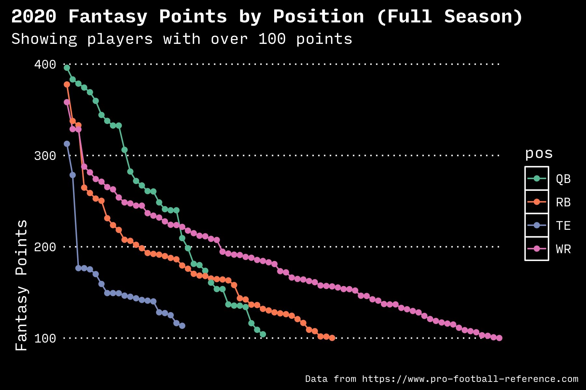

# Experimental: Fantasy Football Metrics 2021

Uses the R language to calculate fantasy football metrics.

The initial scratchpad uses data from [NFL Fantasy Football](https://fantasy.nfl.com). Using the NFL's projected points for each player, it calculates an average for all positions and scores each player based on their projected value over the average value for the position.

For example, of the top 100 players, all running backs are projected to average `220.7` points each. If Christian McCaffrey is projected to score `312.63` points for the season, his points over expected is `91` because `312.63 - 220.7 = 91` (rounded).

